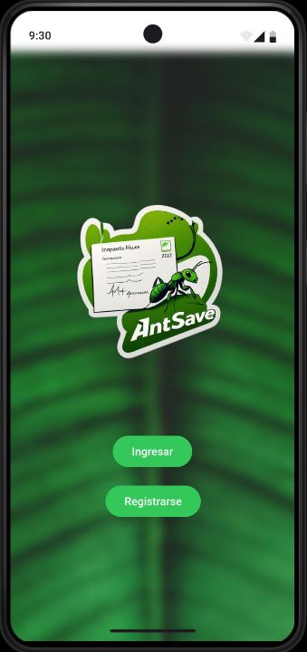
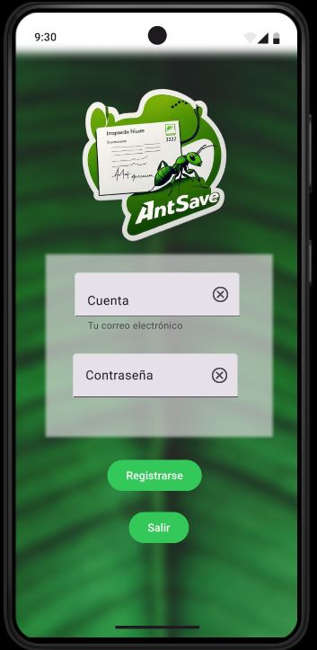
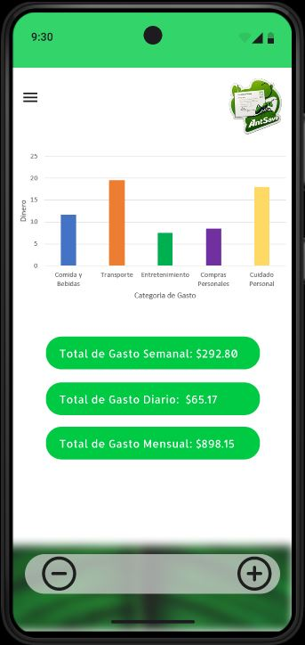
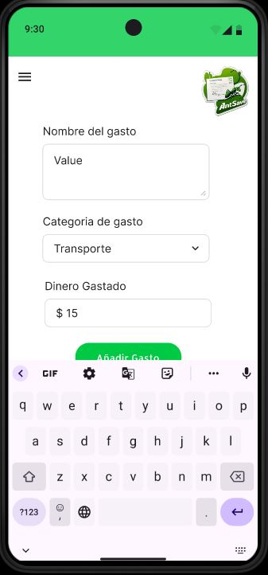
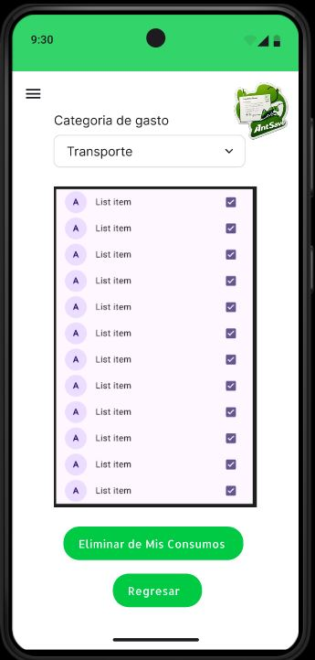
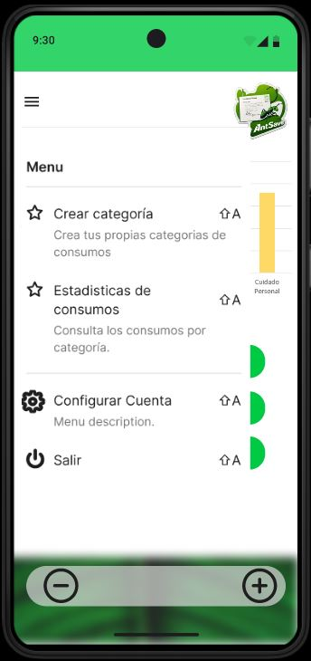
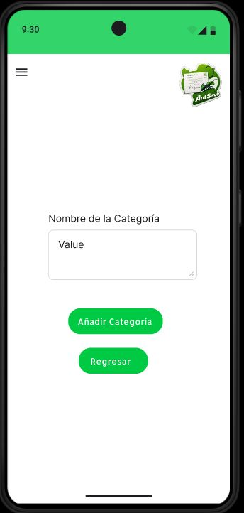
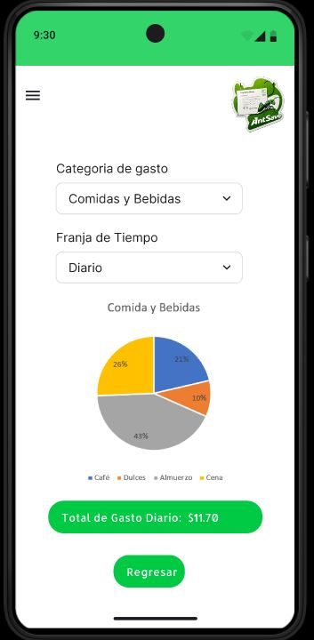
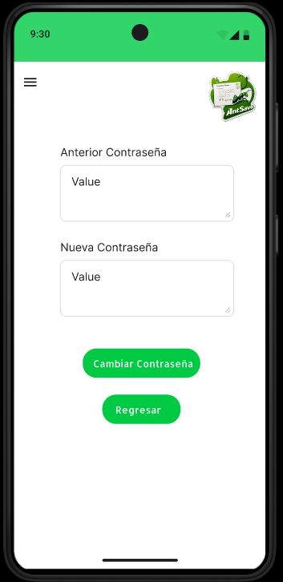

# Interfaz de usuarios
## Landing de apliación

## Ingreso de apliación

## Registro de apliación

## Pagina principal de apliación

## Añadir gasto

## Quitar gasto

## Menu de la aplicación

## Guardar Categoria

## Estadisticas de consumos

## Cambio de Contraseña

